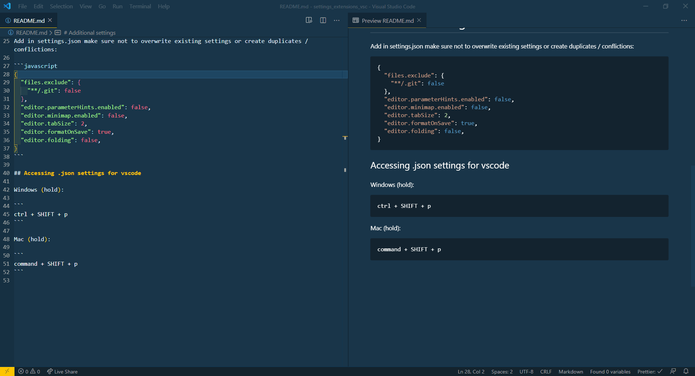
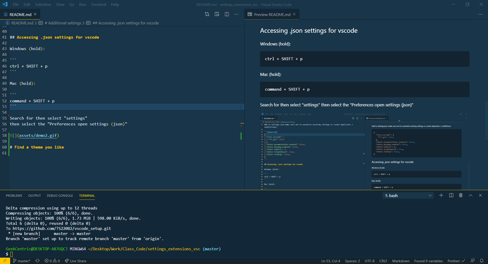

# Extensions:

- Auto Close Tag
- Auto Import
- Auto Import - ES6, TS, JSX, TSX
- Auto Rename Tag
- Bracket Pair Colorizer
- Code Runner
- colorize
- html snippets
- Highlight Matching Tags
- indent-rainbow
- Live Server
- Mantas Third Eye
- NPM Intellisense
- Path Intellisense
- Prettier
- vsc-organize-imports

## Accessing Extensions

view > extensions


# Additional settings

Add in settings.json make sure not to overwrite existing settings or create duplicates / conflictions:

```javascript
{
  "files.exclude": {
    "**/.git": false
  },
  "editor.parameterHints.enabled": false,
  "editor.minimap.enabled": false,
  "editor.tabSize": 2,
  "editor.formatOnSave": true,
  "editor.folding": false,
}
```

## Accessing .json settings for vscode

Windows (hold):

```
ctrl + SHIFT + p
```

Mac (hold):

```
command + SHIFT + p
```

Search for then select "settings"
then select the "Preferences open settings (json)"



# Find a theme you like

Windows (hold):

```
ctrl + SHIFT + p
```

Mac (hold):

```
command + SHIFT + p
```

Search for then select "theme"

Scroll to where you see "install additional themes"


